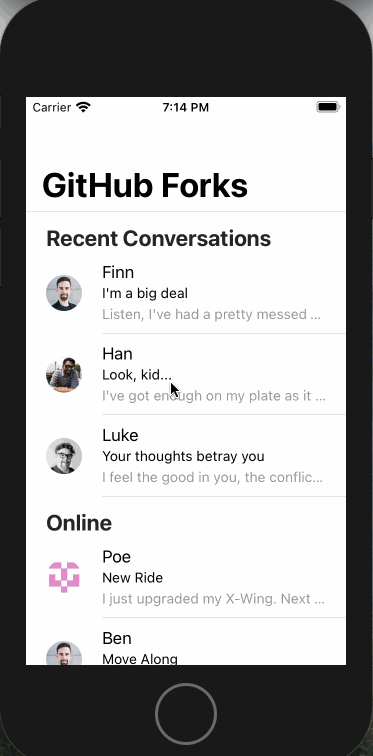
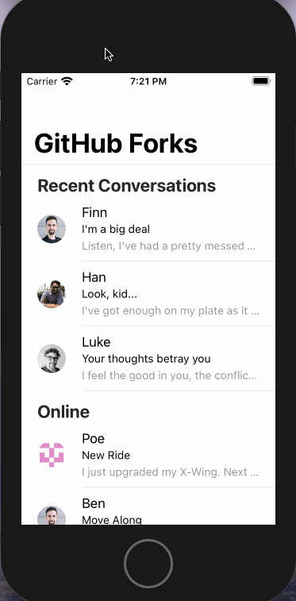

# disable-ios-scrolling

A disable-ios-scrolling plugin for disablling native scrolling Behaviour on iOS devices. This plugin is for those who wanted to disbled native scrolling functionality.

## Environment variables

- You need higher version of ionic (ionicv4).

## How to use this
- You need to install plugin using `npm` by `npm i disable-ios-scrolling`.
- You need to add `disable-ios-scrolling` into your plugin section in `package.json`

## Live Demo

### You can see live Demo here : by using  disable-ios-scrolling:

 
### You can see live Demo here : without using  disable-ios-scrolling:

